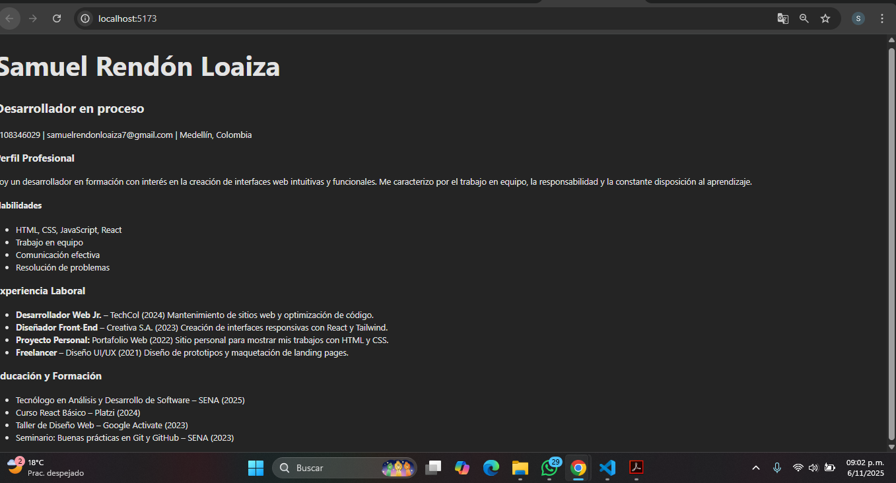

# CV Modular en React – Samuel Rendón Loaiza

Este proyecto consiste en la construcción de una hoja de vida modular desarrollada en React, aplicando el uso de componentes funcionales y control de versiones con Git y GitHub.

## Cómo ejecutar el proyecto

1. Clonar el repositorio:
   ```bash
   git clone https://github.com/samuL03/trabajo-con-vite.git

# captura de interfaz grafica

